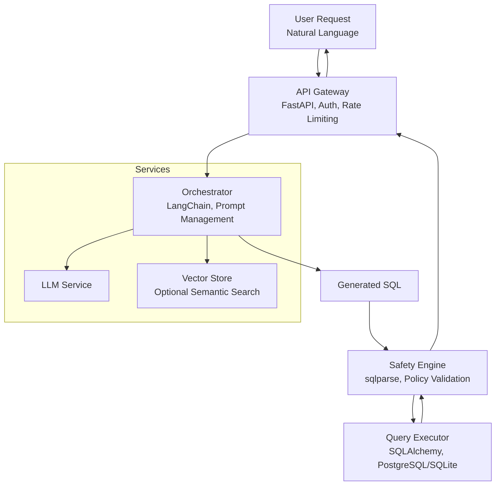

# System Architecture

## Overview

The LLM-based DBMS is designed as a modular, layered system that translates natural language queries into SQL, executes them against a relational database, and returns the results.

## Layers

### 1. API Layer (`backend/api/`)
- **Technology**: FastAPI
- **Responsibilities**:
 - Handle HTTP requests (`/query`, `/health`, `/schema`).
 - Request validation using Pydantic models.
 - Error handling and response formatting.
 - CORS configuration.

### 2. LLM Orchestration Layer (`backend/llm/`)
- **Technology**: LangChain, OpenAI API (or Mock)
- **Responsibilities**:
 - Construct prompts with database schema and examples.
 - Interact with the LLM provider.
 - **Abstraction**: `LLMClient` abstract base class allows swapping providers (e.g., OpenAI vs Local vs Mock).

### 3. Safety Layer (`backend/safety/`)
- **Technology**: Python (Regex, Rule-based)
- **Responsibilities**:
 - Validate generated SQL before execution.
 - **Rules**:
 - Block destructive commands (`DROP`, `DELETE`, `UPDATE`).
 - Prevent multiple statements (semicolon injection).
 - Restrict to allowed tables.

### 4. Database Layer (`backend/database/`)
- **Technology**: SQLAlchemy, SQLite
- **Responsibilities**:
 - Manage database connections (`connection.py`).
 - Define schema metadata (`schema.py`).
 - Execute raw SQL queries (`executor.py`).

## System Diagram

## Data Flow

1. **User** sends a natural language question to `POST /query`.
2. **API** receives the request and calls the **LLM Client**.
3. **LLM Client** constructs a prompt with the schema and sends it to the LLM.
4. **LLM** generates a SQL query.
5. **API** passes the SQL to the **Safety Validator**.
6. If valid, **API** passes the SQL to the **Database Executor**.
7. **Database** executes the query and returns rows.
8. **API** formats the results and returns them to the user.
